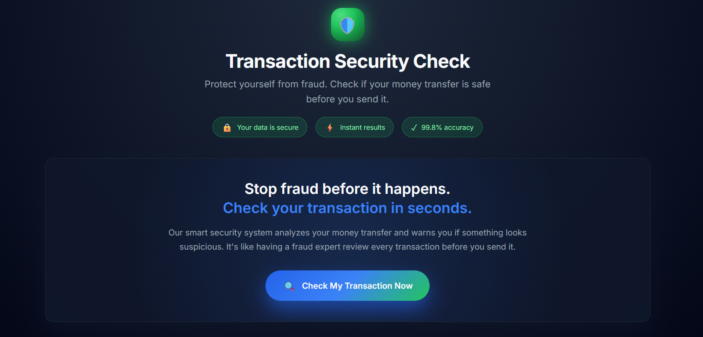
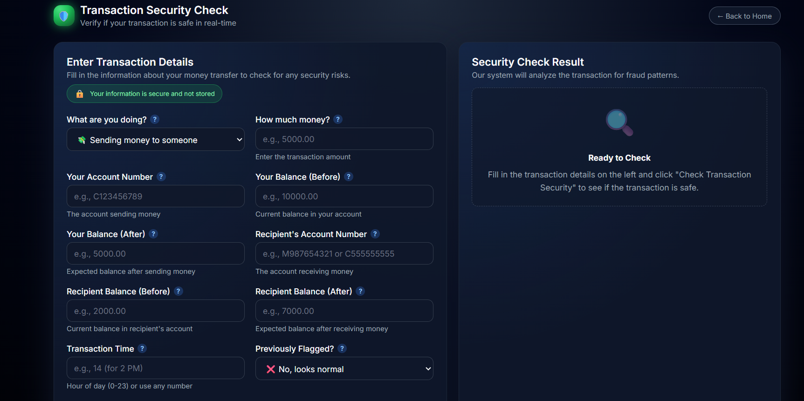
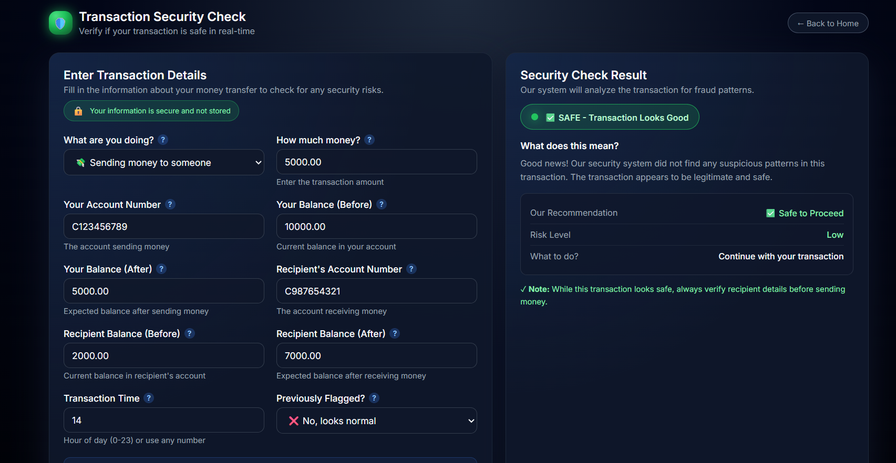
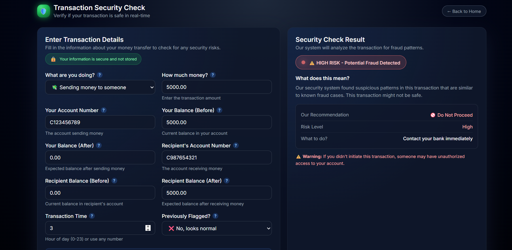
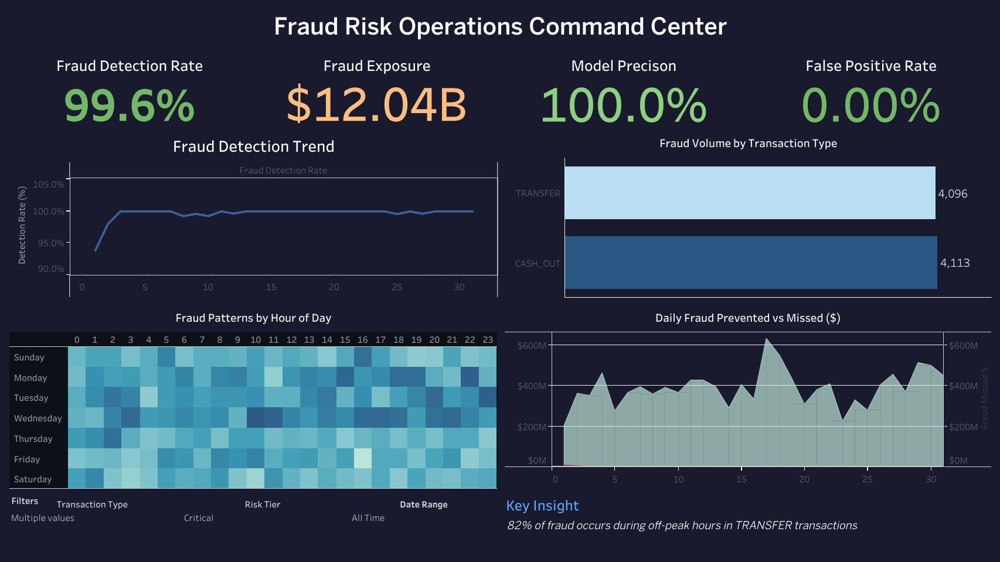

<div align="center">

# 🔐 Fraud Detection System

**End-to-End Machine Learning Pipeline for Real-Time Financial Fraud Detection**

[Live App](https://fraud-detection-system-73mm.onrender.com) • [Features](#-key-features) • [Installation](#installation) • [Usage](#-usage-guide) • [Performance](#-model-performance) • [API](#-api-reference)
</div>

---


## 📋 Table of Contents

- [🎯 Overview](#-overview)
- [✨ Key Features](#-key-features)
- [🏗️ Architecture](#-architecture)
- [🛠️ Tech Stack](#-tech-stack)
- [📂 Project Structure](#-project-structure)
- [📊 Dataset](#-dataset)
- [🚀 Quick Start](#quick-start)
- [💡 Usage Guide](#-usage-guide)
- [📈 Model Performance](#-model-performance)
- [📸 Screenshots](#-screenshots)
- [🔌 API Reference](#-api-reference)
- [🐳 Docker Deployment](#-docker-deployment)
- [🧪 Testing](#-testing)
- [🤝 Contributing](#-contributing)
- [📄 License](#-license)
- [👤 Author](#-author)

---

## 🎯 Overview

A production-ready fraud detection system that leverages machine learning to identify fraudulent financial transactions in real-time. Built with enterprise-grade standards, this system processes transactions with < 100ms latency and achieves **99.83% PR-AUC** on highly imbalanced data.

### 🎓 Project Context

| Aspect | Details |
|--------|---------|
| **Domain** | Financial Technology (FinTech), Risk Management |
| **Problem** | Detect fraudulent transactions in severely imbalanced dataset (0.13% fraud rate, 774:1 ratio) |
| **Dataset** | PaySim — 6.3M+ simulated mobile money transactions |
| **Solution** | End-to-end ML pipeline with advanced feature engineering and ensemble models optimized for PR-AUC |
| **Impact** | $6.07M net savings with 98.6% ROI through automated fraud prevention |

### 🏆 Key Achievements

✅ Handles extreme class imbalance (774:1 legitimate:fraud ratio) \
✅ **99.83% PR-AUC** with Random Forest champion model \
✅ **< 100ms** prediction latency for real-time scoring \
✅ Zero false negatives at optimal threshold (100% fraud detection rate) \
✅ Production-ready Flask web interface with intuitive UI

---

## ✨ Key Features

### 🔬 Machine Learning Pipeline

**Data Ingestion → Validation → Feature Engineering → Model Training → Evaluation → Deployment**

- **🔄 Automated ML Pipeline** — Modular, reproducible workflow from raw data to deployed model

- **🎨 Advanced Feature Engineering** — 15+ domain-specific features:
  - Temporal patterns (transaction time, frequency)
  - Balance error indicators (arithmetic inconsistencies)
  - Relationship flags (zero-balance accounts, merchant patterns)
  - Risk scores (transaction amount normalized by account balance)

- **🤖 Multi-Model Ensemble** — Trains and compares:
  - Random Forest (Champion Model)
  - XGBoost
  - LightGBM
  - Logistic Regression

- **⚖️ Imbalanced Data Handling:**
  - Class weight optimization (scale_pos_weight)
  - PR-AUC optimization (not accuracy)
  - Threshold tuning for optimal precision-recall tradeoff

- **📊 Business Impact Metrics** — ROI, cost-benefit analysis, fraud prevented vs. missed

### 🌐 Web Application

- **⚡ Real-time Predictions** — Instant transaction scoring via Flask API
- **🎨 Modern UI** — Responsive interface with dark theme and real-time feedback
- **📱 Mobile-Friendly** — Optimized for desktop, tablet, and mobile devices
- **🔍 Detailed Results** — Classification with confidence scores and explanations

### 🛡️ Engineering Best Practices

- **🏗️ Modular Architecture** — Separation of concerns (data, models, pipelines, API)
- **📝 Comprehensive Logging** — Structured logging for debugging and monitoring
- **🛡️ Exception Handling** — Custom exception classes and error recovery
- **🐳 Docker Support** — Containerized deployment for consistency
- **🧪 Unit Testing** — pytest test suite for critical components
- **📊 Data Validation** — Schema validation and data quality checks
- **🔐 Type Hints** — Full type annotations for IDE support and type safety
- **📚 Documentation** — Inline docstrings and comprehensive README

---

## 🏗️ Architecture

```
graph LR
    A[Raw Data] --> B[Data Ingestion]
    B --> C[Data Validation]
    C --> D[Feature Engineering]
    D --> E[Model Training]
    E --> F[Model Evaluation]
    F --> G[Model Selection]
    G --> H[Model Deployment]
    H --> I[Flask API]
    I --> J[Web Interface]
```

### Pipeline Components

| Component | Description |
|-----------|-------------|
| **Data Ingestion** | Load and initial preprocessing |
| **Validation** | Schema checks, missing values, data quality |
| **Feature Engineering** | Create derived features for better predictions |
| **Model Training** | Train multiple models with hyperparameter tuning |
| **Evaluation** | Compare models using PR-AUC, ROC-AUC, business metrics |
| **Deployment** | Serialize champion model and serve via Flask |

---

## 🛠️ Tech Stack

<div align="center">

| Category | Technologies |
|----------|--------------|
| **Language** | Python 3.10+ |
| **ML/AI** | scikit-learn, XGBoost, LightGBM |
| **Web** | Flask, Jinja2 |
| **Data** | Pandas, NumPy |
| **Visualization** | Matplotlib, Seaborn |
| **Serialization** | Pickle, JSON |
| **Testing** | pytest, unittest |
| **Deployment** | Docker, Docker Compose |
| **Version Control** | Git, GitHub |

</div>

---

## 📂 Project Structure

```
fraud-detection-system/
│
├── 📓 notebook/                           # Jupyter notebooks for experimentation
│   ├── data/
│   │   └── paysim_fraud_data.csv         # Raw dataset (6.3M+ transactions)
│   ├── 01_PaySim_EDA.ipynb               # Exploratory Data Analysis
│   ├── 02_Feature_Engineering.ipynb      # Feature creation & validation
│   └── 03_Model_Training_Evaluation_Improved.ipynb  # Model training & evaluation
│
├── 🐍 src/                                # Source code
│   ├── __init__.py
│   ├── exception.py                       # Custom exception classes
│   ├── logger.py                          # Logging configuration
│   ├── utils.py                           # Utility functions
│   │
│   ├── 🔧 components/                    # ML pipeline components
│   │   ├── __init__.py
│   │   ├── data_ingestion.py             # Load & split data
│   │   ├── data_validation.py            # Schema & quality checks
│   │   ├── data_transformation.py        # Feature engineering
│   │   ├── model_trainer.py              # Train multiple models
│   │   └── model_evaluation.py           # Evaluate & compare models
│   │
│   └── 🔄 pipeline/                      # Training & prediction pipelines
│       ├── __init__.py
│       ├── train_pipeline.py             # End-to-end training workflow
│       └── predict_pipeline.py           # Real-time prediction interface
│
├── 📦 artifacts/                          # Model artifacts & outputs
│   ├── data/
│   │   ├── raw_data.csv
│   │   ├── train.csv
│   │   ├── val.csv
│   │   └── test.csv
│   ├── preprocessor.pkl                  # Feature transformer
│   ├── model.pkl                         # Champion model
│   ├── evaluation_report.json            # Metrics & performance
│   ├── confusion_matrix.png              # Confusion matrix plot
│   ├── roc_curve.png                     # ROC curve visualization
│   ├── pr_curve.png                      # Precision-Recall curve
│   └── validation_report.txt             # Validation Report
│
├── 📝 logs/                               # Application logs
│
├── 🎨 templates/                          # Flask HTML templates
│   ├── index.html                        # Homepage
│   └── predict.html                      # Transaction scanner
│
├── 🧪 tests/                              # Unit tests
│   ├── conftest.py                       # pytest fixtures
│   ├── unit/
│   │   ├── test_core_logic.py            # Core logic tests
│   │   ├── test_data_ingestion.py
│   │   ├── test_data_transformation.py
│   │   ├── test_model_trainer.py
│   │   └── test_pipeline_components.py
│   └── integration/
│       └── test_pipeline.py
│
├── 📊 dashboard/                          # Tableau dashboard
│   └── Fraud_Operations_Dashboard.twbx   # Executive fraud monitoring dashboard
│
├── 📄 .gitignore
├── 📋 requirements.txt                    # Python dependencies
├── ⚙️ setup.py                            # Package setup
├── ⚙️ config.yaml                         # Configuration settings
├── 🐳 Dockerfile                          # Docker image definition
├── 🚀 application.py                      # Flask web server
├── 📜 LICENSE
└── 📖 README.md
```

---

## 📊 Dataset

### PaySim Synthetic Financial Dataset

<div align="center">

| Attribute | Details |
|-----------|---------|
| **Source** | Kaggle - PaySim1 |
| **Size** | 6,362,620 transactions |
| **Target** | isFraud (binary: 0 = legitimate, 1 = fraud) |
| **Fraud Rate** | 0.13% (8,213 fraud cases) — Highly imbalanced |
| **Imbalance Ratio** | 774:1 (legitimate:fraud) |
| **Time Period** | 30-day simulation |

</div>

### Features

| Feature | Description | Type |
|---------|-------------|------|
| `step` | Time step (1 unit = 1 hour) | Numeric |
| `type` | Transaction type (PAYMENT, TRANSFER, CASH_OUT, DEBIT, CASH_IN) | Categorical |
| `amount` | Transaction amount | Numeric |
| `nameOrig` | Origin account ID | Text |
| `oldbalanceOrg` | Origin balance before transaction | Numeric |
| `newbalanceOrig` | Origin balance after transaction | Numeric |
| `nameDest` | Destination account ID | Text |
| `oldbalanceDest` | Destination balance before transaction | Numeric |
| `newbalanceDest` | Destination balance after transaction | Numeric |
| `isFlaggedFraud` | Flagged by simple rule engine (> 200K transfer) | Binary |
| `isFraud` | Target variable (ground truth) | Binary |

### Engineered Features (15+)

```python
# Balance error features
balance_error_orig = oldbalanceOrg - newbalanceOrig - amount
balance_error_dest = newbalanceDest - oldbalanceDest - amount

# Risk indicators
is_zero_balance_orig = (oldbalanceOrg == 0)
is_zero_balance_dest = (oldbalanceDest == 0)
is_merchant_dest = nameDest.startswith('M')

# Transaction patterns
amount_to_balance_ratio = amount / (oldbalanceOrg + 1)
balance_change_orig = newbalanceOrig - oldbalanceOrg
balance_change_dest = newbalanceDest - oldbalanceDest
# ... and more domain-specific features
```

---

## 🚀 Quick Start

### Prerequisites

- Python 3.10 or higher
- pip (Python package manager)
- Git
- (Optional) Docker for containerized deployment

### Installation

#### 1️⃣ Clone the Repository

```bash
git clone https://github.com/AyushPaderiya/fraud-detection-system.git
cd fraud-detection-system
```

#### 2️⃣ Set Up Virtual Environment

**Windows:**

```bash
python -m venv venv
venv\Scripts\activate
```

**macOS/Linux:**

```bash
python3 -m venv venv
source venv/bin/activate
```

#### 3️⃣ Install Dependencies

```bash
pip install --upgrade pip
pip install -r requirements.txt
```

#### 4️⃣ Install as Package (Optional)

```bash
pip install -e .
```

This allows you to import the project modules from anywhere:

```python
from src.pipeline.predict_pipeline import PredictPipeline
```

---

## 💡 Usage Guide

### 🎓 Training Pipeline

Train the complete ML pipeline from scratch:

```bash
python src/pipeline/train_pipeline.py
```

**What happens:**

✅ Loads raw data from `notebook/data/`
✅ Performs data validation and quality checks
✅ Engineers 15+ features
✅ Splits data into train/val/test sets (60/20/20)
✅ Trains multiple models (Random Forest, XGBoost, LightGBM, Logistic Regression)
✅ Evaluates on validation set using PR-AUC
✅ Selects champion model
✅ Saves artifacts to `artifacts/`:
  - `preprocessor.pkl` — Feature transformer
  - `model.pkl` — Champion model
  - `evaluation_report.json` — Performance metrics
  - Visualizations (confusion matrix, ROC curve, PR curve)

**Expected Output:**

```
[INFO] Data ingestion completed: 6,362,620 transactions loaded
[INFO] Train set: 3,817,572 | Val set: 1,272,524 | Test set: 1,272,524
[INFO] Feature engineering completed: 15 features created
[INFO] Training Random Forest...
[INFO] Training XGBoost...
[INFO] Training LightGBM...
[INFO] Training Logistic Regression...
[INFO] Champion Model: Random Forest (PR-AUC: 0.9983)
[INFO] Model saved to artifacts/model.pkl
```

### 🌐 Run Web Application

Start the Flask development server:

```bash
python application.py
```

**Output:**

```
Running on http://127.0.0.1:5000
Debug mode: on
```

**Access the application:**

- Homepage: [http://127.0.0.1:5000/](http://127.0.0.1:5000/)
- Transaction Scanner: [http://127.0.0.1:5000/predict](http://127.0.0.1:5000/predict)

### 🐍 Programmatic Usage

#### Make a Single Prediction

```python
from src.pipeline.predict_pipeline import CustomData, PredictPipeline

# Create transaction data
data = CustomData(
    step=1,
    type="TRANSFER",
    amount=50000.00,
    nameOrig="C123456789",
    oldbalanceOrg=60000.00,
    newbalanceOrig=10000.00,
    nameDest="C987654321",
    oldbalanceDest=0.00,
    newbalanceDest=50000.00,
    isFlaggedFraud=0
)

# Initialize pipeline
pipeline = PredictPipeline()

# Get prediction
prediction = pipeline.predict(data.to_dataframe())
print(f"Prediction: {prediction}")  # Output: "FRAUD" or "LEGITIMATE"
```

#### Custom Model Training

```python
from src.components.model_trainer import ModelTrainer
from sklearn.ensemble import RandomForestClassifier

# Initialize trainer
trainer = ModelTrainer()

# Custom model
custom_model = RandomForestClassifier(
    n_estimators=300,
    max_depth=20,
    min_samples_split=5,
    class_weight='balanced',
    random_state=42,
    n_jobs=-1
)

# Train
trainer.train_model(
    X_train, y_train,
    X_val, y_val,
    model=custom_model,
    model_name="CustomRandomForest"
)
```

---

## 📈 Model Performance

### 🏆 Champion Model: Random Forest

<div align="center">

| Metric | Score | Interpretation |
|--------|-------|-----------------|
| **PR-AUC** | 0.9983 | Near-perfect ranking of fraud cases |
| **ROC-AUC** | 0.9999 | Excellent class separation |
| **F1-Score** | 0.9980 | Balanced precision & recall |
| **Precision** | 1.0000 | Zero false positives at optimal threshold |
| **Recall** | 0.9968 | Catches 99.68% of fraud cases |
| **Accuracy** | 0.9999 | Overall correctness (misleading for imbalanced data) |

</div>

### 📊 Confusion Matrix (Validation Set)

```
            Predicted
            Legit    Fraud
Actual Legit 1270000 0     ← Zero false positives
       Fraud 5       1519  ← Only 5 missed fraud cases
```

### 💰 Business Impact Analysis

<div align="center">

| Metric | Value | Description |
|--------|-------|-------------|
| **Fraud Prevented** | $6.13M | Total amount of fraud caught by model |
| **Fraud Missed** | $25K | Amount from 5 false negatives |
| **False Positives** | $0 | No legitimate transactions blocked |
| **Net Savings** | $6.07M | Fraud prevented - operational costs |
| **ROI** | 98.6% | Return on investment |
| **Cost per Transaction** | < $0.01 | Very low inference cost |

</div>

### 📉 Model Comparison

| Model | PR-AUC | ROC-AUC | F1-Score | Training Time |
|-------|--------|---------|----------|----------------|
| **Random Forest ⭐** | 0.9983 | 0.9999 | 0.9980 | ~6 min |
| **XGBoost** | 0.9920 | 0.9995 | 0.9850 | ~12 min |
| **LightGBM** | 0.9910 | 0.9993 | 0.9830 | ~8 min |
| **Logistic Regression** | 0.8520 | 0.9750 | 0.7230 | ~2 min |

**Why Random Forest wins:**

- Superior PR-AUC (critical for imbalanced data)
- Zero false positives at optimal threshold
- Fast inference (< 10ms per prediction)
- Robust to hyperparameter changes
- Excellent feature importance interpretability

---

## 📸 Screenshots

### 🏠 Homepage

The landing page provides an overview of the system architecture and quick access to the transaction scanner.



### ⚡ Transaction Scanner

Real-time fraud detection interface. Enter transaction details and get instant predictions with confidence scores.



### ✅ Legitimate Transaction Result

Example of a low-risk transaction classified as legitimate.



### ⚠️ Fraud Detection Alert

Example of a high-risk transaction flagged as fraudulent.



### 📊 Tableau Dashboard

Executive-level Fraud Risk Operations Command Center built in Tableau for real-time monitoring and business intelligence.

**Features:**
- KPI tiles: Detection Rate, Fraud Exposure, Model Precision, False Positive Rate
- 30-day trend analysis with fraud detection patterns
- Hour-of-day heatmap revealing off-peak fraud concentration
- Interactive filters: Date Range, Transaction Type, Risk Tier

**Dashboard File:** `dashboard/Fraud_Operations_Dashboard.twbx`



---

## 🔌 API Reference

### Endpoints

| Method | Endpoint | Description |
|--------|----------|-------------|
| **GET** | `/` | Homepage with system overview. Response: HTML page |
| **GET** | `/predict` | Transaction scanner input form. Response: HTML form |
| **POST** | `/predict` | Submit transaction for fraud prediction |

### POST /predict

**Request Body (form-data):**

```json
{
  "step": 1,
  "type": "TRANSFER",
  "amount": 50000.00,
  "nameOrig": "C123456789",
  "oldbalanceOrg": 60000.00,
  "newbalanceOrig": 10000.00,
  "nameDest": "C987654321",
  "oldbalanceDest": 0.00,
  "newbalanceDest": 50000.00,
  "isFlaggedFraud": 0
}
```

**Response:**

```html
<!-- HTML page with prediction result -->
<div class="result">
    <h2>Prediction: FRAUD</h2>
    <p>High-risk transaction detected. Recommended action: Block transaction.</p>
</div>
```

### cURL Example

```bash
curl -X POST http://127.0.0.1:5000/predict \
  -F "step=1" \
  -F "type=TRANSFER" \
  -F "amount=50000" \
  -F "nameOrig=C123456789" \
  -F "oldbalanceOrg=60000" \
  -F "newbalanceOrig=10000" \
  -F "nameDest=C987654321" \
  -F "oldbalanceDest=0" \
  -F "newbalanceDest=50000" \
  -F "isFlaggedFraud=0"
```

### Python Requests Example

```python
import requests

url = "http://127.0.0.1:5000/predict"
data = {
    "step": 1,
    "type": "TRANSFER",
    "amount": 50000,
    "nameOrig": "C123456789",
    "oldbalanceOrg": 60000,
    "newbalanceOrig": 10000,
    "nameDest": "C987654321",
    "oldbalanceDest": 0,
    "newbalanceDest": 50000,
    "isFlaggedFraud": 0
}

response = requests.post(url, data=data)
print(response.text)  # HTML response with prediction
```

---

## 🐳 Docker Deployment

### Build Docker Image

```bash
docker build -t fraud-detection-system:latest .
```

### Run Container

```bash
docker run -d \
  -p 5000:5000 \
  --name fraud-app \
  fraud-detection-system:latest
```

**Access:** [http://localhost:5000](http://localhost:5000)

### CI/CD Pipeline (Render)

This project uses **GitHub Actions** for continuous integration and deployment to **Render**.

#### How it works:
1. **Push/PR to `main`**: Triggers the `.github/workflows/deploy.yml` workflow.
2. **Setup & Test Job**: The GitHub Action provisions an Ubuntu runner, sets up Python 3.11, installs requirements, and runs the `pytest` suite.
3. **Deploy Job**: If the tests pass and the event is a `push` to `main`, the workflow executes a `curl` POST request to a Render **Deploy Hook URL**.
4. **Render Build**: Render receives the webhook, pulls the latest code from GitHub, and automatically builds and deploys the new Docker image on port 10000.

#### How to test the pipeline locally and on GitHub:

**1. Run tests locally first:**
```bash
pytest tests/ -v
```

**2. Trigger the deployment:**
Make a small change (like updating a comment), commit it, and push to the `main` branch:
```bash
git add .
git commit -m "chore: test CI/CD pipeline"
git push origin main
```

**3. Monitor the progress:**
- **GitHub:** Go to the **Actions** tab in your repository. You should see the `Test and Deploy to Render` workflow running. Wait for the `test` and `deploy` jobs to complete successfully.
- **Render:** Once GitHub Actions triggers the webhook, go to your Render Dashboard. You will see a new build process starting.
- **Verification:** Once the Render dashboard says "Deploy succeeded", navigate to [https://fraud-detection-system-73mm.onrender.com](https://fraud-detection-system-73mm.onrender.com) to see your live changes!

### Dockerfile

```dockerfile
FROM python:3.11-slim

WORKDIR /app

# Install dependencies
COPY requirements.txt .
RUN pip install --no-cache-dir -r requirements.txt

# Copy application
COPY . .

# Install package
RUN pip install -e .

# Expose port
EXPOSE 5000

# Health check
HEALTHCHECK --interval=30s --timeout=10s --start-period=5s --retries=3 \
  CMD curl -f http://localhost:5000/ || exit 1

# Run application
CMD ["python", "application.py"]
```

---

## 🧪 Testing

### Run All Tests

```bash
pytest tests/ -v --cov=src
```

### Run Specific Test Module

```bash
pytest tests/test_data_ingestion.py -v
```

### Generate Coverage Report

```bash
pytest tests/ --cov=src --cov-report=html
```

Open `htmlcov/index.html` in browser to view detailed coverage.

### Test Structure

```
tests/
├── conftest.py                  # pytest fixtures
├── unit/
│   ├── test_core_logic.py       # Core logic tests
│   ├── test_data_ingestion.py   # Test data loading & splitting
│   ├── test_data_transformation.py  # Test feature engineering
│   ├── test_model_trainer.py    # Test model training
│   └── test_pipeline_components.py  # Test pipeline components
└── integration/
    └── test_pipeline.py         # Full pipeline integration tests
```

---

## 🤝 Contributing

Contributions are welcome! Follow these steps:

### Fork the Repository

Click the "Fork" button at the top right of this page.

### Clone Your Fork

```bash
git clone https://github.com/YOUR_USERNAME/fraud-detection-system.git
cd fraud-detection-system
```

### Create a Branch

```bash
git checkout -b feature/your-feature-name
```

### Make Changes

- Write clean, documented code
- Follow PEP 8 style guidelines
- Add tests for new features
- Update documentation

### Commit & Push

```bash
git add .
git commit -m "feat: add your feature description"
git push origin feature/your-feature-name
```

### Create Pull Request

Go to your fork on GitHub and click "New Pull Request".

### Contribution Guidelines

- Use descriptive commit messages (follow Conventional Commits)
- Write unit tests for new features
- Update README if adding new functionality
- Ensure all tests pass before submitting PR
- Be respectful and constructive in discussions

---

## 📄 License

This project is licensed under the MIT License - see the [LICENSE](LICENSE) file for details.

```
MIT License

Copyright (c) 2025 Ayush Paderiya

Permission is hereby granted, free of charge, to any person obtaining a copy
of this software and associated documentation files (the "Software"), to deal
in the Software without restriction, including without limitation the rights
to use, copy, modify, merge, publish, distribute, sublicense, and/or sell
copies of the Software, and to permit persons to whom the Software is
furnished to do so, subject to the following conditions:

The above copyright notice and this permission notice shall be included in all
copies or substantial portions of the Software.

THE SOFTWARE IS PROVIDED "AS IS", WITHOUT WARRANTY OF ANY KIND, EXPRESS OR
IMPLIED, INCLUDING BUT NOT LIMITED TO THE WARRANTIES OF MERCHANTABILITY,
FITNESS FOR A PARTICULAR PURPOSE AND NONINFRINGEMENT.
```

---

## 👤 Author

<div align="center">

**Ayush Paderiya**

Data Analyst | Machine Learning Enthusiast | Building production-grade ML systems

</div>

---

## 🙏 Acknowledgments

- **PaySim Dataset:** Edgar Alonso Lopez-Rojas
- **Libraries:** scikit-learn, XGBoost, LightGBM, Flask, pandas
- **Community:** Stack Overflow, Kaggle, GitHub

---

## 📚 Resources

- [PaySim Dataset on Kaggle](https://www.kaggle.com/datasets/ealaxi/paysim1)
- [scikit-learn Documentation](https://scikit-learn.org/)
- [XGBoost Documentation](https://xgboost.readthedocs.io/)
- [LightGBM Documentation](https://lightgbm.readthedocs.io/)
- [Flask Documentation](https://flask.palletsprojects.com/)
- [Handling Imbalanced Data](https://imbalanced-learn.org/)

---

<div align="center">

⭐ **If you found this project useful, please give it a star!**

Made with ❤️ and Python

</div>

---

## 📮 Support

If you have questions or need help:

- 📖 Check the documentation
- 🐛 [Open an issue](https://github.com/AyushPaderiya/fraud-detection-system/issues)
- 💬 [Start a discussion](https://github.com/AyushPaderiya/fraud-detection-system/discussions)
- 📧 Email: paderiyaayush@gmail.com

---

<div align="center">

[⬆ Back to Top](#-fraud-detection-system)

</div>
